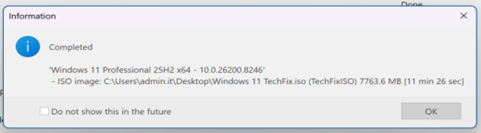
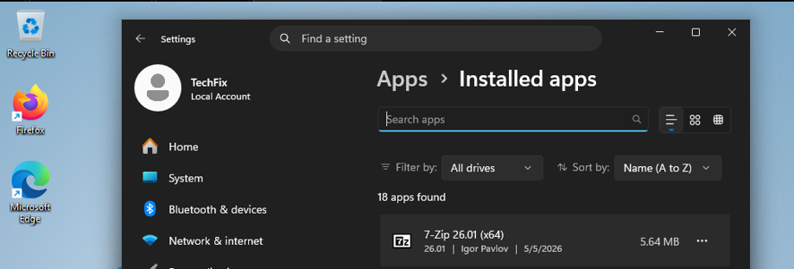
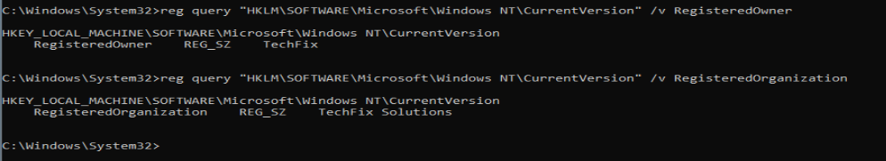
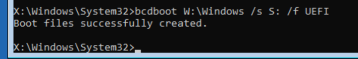
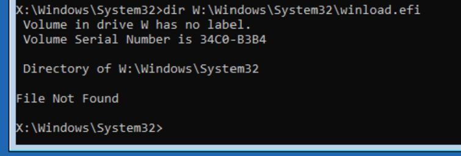
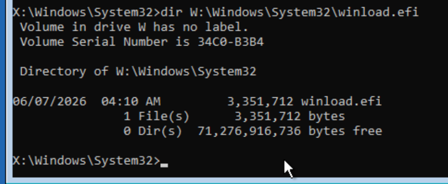
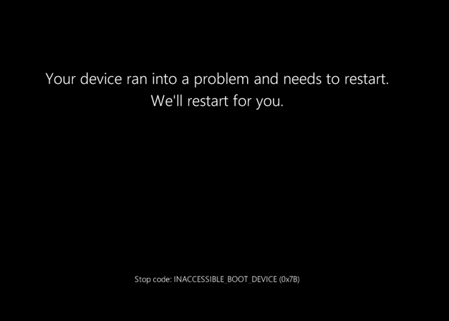
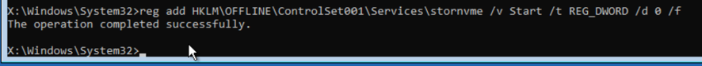
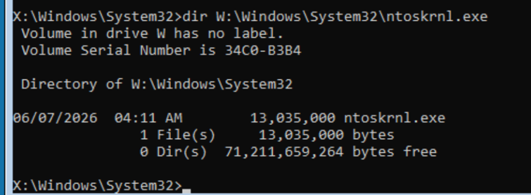

# Windows 11 Endpoint Administration, Deployment & Recovery Lab

Practical Windows 11 endpoint laboratory focused on custom OS deployment, unattended configuration, evidence-driven boot recovery and targeted security hardening.

## Overview

This repository brings together a set of controlled Windows endpoint administration exercises performed in VMware Workstation.

The project is organized as a technical case study rather than a collection of coursework. It focuses on three areas that are directly relevant to endpoint support and junior systems administration:

- custom Windows 11 image preparation and deployment;
- advanced startup recovery using Windows PE and offline repair techniques;
- targeted Windows security hardening with CIS-CAT validation.

The emphasis throughout the project is on **verification**: a configuration change or repair command is not treated as successful until the resulting system state is checked independently.

> **Lab boundary:** all work was completed in an isolated training environment. This repository documents practical laboratory administration and troubleshooting; it does not represent a production endpoint-management rollout.

---

## Technical Scope

| Area | Practical Work |
|---|---|
| Windows deployment | Windows 11 Pro image customization with NTLite |
| Application provisioning | Silent Post-Setup installation of 7-Zip and Firefox |
| Unattended setup | Local-account setup behavior and registered organization settings |
| Deployment validation | Installed applications, power plan and registry values |
| Boot recovery | Windows PE, DiskPart, `bcdboot`, offline SFC and offline registry |
| Storage-driver recovery | Diagnosis and recovery of `INACCESSIBLE_BOOT_DEVICE` |
| System-file recovery | Recovery of `winload.efi` and `ntoskrnl.exe` |
| Security hardening | CIS-CAT assessment, targeted remediation and re-scan validation |
| Virtualization | VMware Workstation |
| Troubleshooting model | Symptom → evidence → diagnosis → remediation → validation |

---

# 1. Custom Windows 11 Deployment

A Windows 11 Pro installation image was customized with **NTLite** for the fictional organization **TechFix Solutions**.

The objective was to create a repeatable endpoint installation with selected business-oriented settings, automatic application provisioning and unattended setup options, then validate the result in a clean VMware virtual machine.

### Deployment Workflow

```text
Clean Windows 11 Pro image
        ↓
NTLite customization
        ↓
Post-Setup application provisioning
        ↓
Unattended configuration
        ↓
Custom ISO generation
        ↓
Fresh VMware installation
        ↓
Installed-system validation
```

### Key Configuration

- 7-Zip and Mozilla Firefox added to Post-Setup;
- silent application installation using `/S`;
- selected non-essential consumer components removed;
- reduced recommendations and suggestions;
- visible file extensions;
- High performance power plan;
- local-account-oriented unattended setup;
- registered organization values for the fictional company;
- custom ISO generated and tested in a new VM.

### Custom ISO Generation


</p>

<p align="center"><em>Customized Windows 11 image successfully processed and exported as a bootable ISO.</em></p>

### Post-Deployment Validation

Successful ISO generation was not considered sufficient evidence by itself. Selected configuration outcomes were checked on the newly installed Windows endpoint.

<p align="center">
  
</p>

<p align="center"><em>Post-Setup validation confirming that the configured applications were installed on the deployed endpoint.</em></p>

The active power plan was also validated with:

```cmd
powercfg /L
```

and organization identity was checked directly in the Windows registry.

<p align="center">
  
</p>

For the complete deployment rationale and validation model, see [`notes/deployment-strategy.md`](notes/deployment-strategy.md).

---

# 2. Windows Boot Recovery & Troubleshooting

The recovery laboratory used four independent failure scenarios.

For every incident, the objective was to restore Windows **without formatting the disk, reinstalling the operating system or deleting the existing user data**.

| Incident | Diagnostic Evidence | Remediation |
|---|---|---|
| Corrupted BCD | Boot configuration failure | Rebuild UEFI boot files with `bcdboot` |
| Missing `winload.efi` | Direct file check returned `File Not Found` | Offline System File Checker |
| `INACCESSIBLE_BOOT_DEVICE` | `stornvme` startup value found disabled | Offline registry remediation |
| Missing `ntoskrnl.exe` | Kernel file absent while related files remained present | Offline System File Checker |

## Case 1 — Corrupted BCD

Windows PE was used to identify the offline Windows installation and EFI System Partition.

The boot environment was rebuilt with:

```cmd
bcdboot W:\Windows /s S: /f UEFI
```

<p align="center">
  
</p>

The command returned `Boot files successfully created`, after which the system was rebooted from disk and Windows started normally.

---

## Case 2 — Missing `winload.efi`

The suspected boot file was checked directly:

```cmd
dir W:\Windows\System32\winload.efi
```

The initial result was `File Not Found`.

<p align="center">
  
</p>

Offline SFC was then executed against the installed Windows image:

```cmd
sfc /scannow /offbootdir=W:\ /offwindir=W:\Windows
```

After remediation, the same file check confirmed that `winload.efi` had been restored.

<p align="center">
  
</p>

---

## Case 3 — `INACCESSIBLE_BOOT_DEVICE`

The system produced the stop code:

```text
INACCESSIBLE_BOOT_DEVICE (0x7B)
```

<p align="center">
  
</p>

Because the VM used NVMe storage, the offline Windows SYSTEM registry hive was loaded and the `stornvme` driver configuration was inspected.

```cmd
reg load HKLM\OFFLINE W:\Windows\System32\Config\SYSTEM
reg query HKLM\OFFLINE\ControlSet001\Services\stornvme /v Start
```

The driver startup value was found at `0x4`, indicating that it was disabled in this scenario.

The value was changed to `0x0`:

```cmd
reg add HKLM\OFFLINE\ControlSet001\Services\stornvme /v Start /t REG_DWORD /d 0 /f
```

The new value was queried again before unloading the hive.

<p align="center">
  
</p>

This incident demonstrates a targeted remediation based on confirmed evidence rather than a generic startup-repair sequence.

---

## Case 4 — Missing `ntoskrnl.exe`

The Windows kernel file was checked directly:

```cmd
dir W:\Windows\System32\ntoskrnl.exe
```

The file was missing, while other startup components such as `hal.dll` and `winload.efi` were present.

Offline SFC was used to repair the Windows installation:

```cmd
sfc /scannow /offbootdir=W:\ /offwindir=W:\Windows
```

A second direct file check confirmed restoration of `ntoskrnl.exe`.

<p align="center">
  
</p>

For the complete four-incident troubleshooting analysis, see [`notes/boot-recovery-cases.md`](notes/boot-recovery-cases.md).

---

# 3. Windows Security Hardening

A controlled Windows 11 security-hardening exercise was performed with **CIS-CAT Lite Assessor** using the **CIS Microsoft Windows 11 Enterprise Benchmark — Level 1**.

The workflow was:

```text
Initial assessment
        ↓
Review selected failed controls
        ↓
Apply targeted remediation
        ↓
Run second assessment
        ↓
Verify selected Fail → Pass transitions
```

Selected verified remediation areas included:

- password history;
- minimum password age;
- account lockout threshold;
- account lockout reset behavior;
- advanced audit-policy enforcement.

The complete CIS-CAT HTML reports are intentionally **not published** because they expose unnecessary endpoint metadata and a large amount of machine-configuration detail.

No claim is made that the endpoint achieved complete CIS Benchmark compliance. The exercise demonstrates the process of **assessment → remediation → independent re-validation** for selected controls.

See [`notes/security-hardening.md`](notes/security-hardening.md) for the sanitized technical summary.

---

# Troubleshooting Method

Across the recovery and hardening work, the same operational pattern was used:

```text
Symptom
   ↓
Evidence collection
   ↓
Technical hypothesis
   ↓
Targeted test
   ↓
Remediation
   ↓
Re-test
   ↓
Functional validation
```

This avoids treating a successful command exit code as proof that the underlying problem has been resolved.

For example:

- `bcdboot` completion was followed by an actual boot test;
- SFC completion was followed by direct verification that the missing file existed again;
- an offline registry edit was followed by a second registry query;
- CIS-CAT remediation was followed by a new security assessment.

---

# Repository Structure

```text
windows-endpoint-administration-lab/
├── README.md
├── notes/
│   ├── boot-recovery-cases.md
│   ├── deployment-strategy.md
│   └── security-hardening.md
└── assets/
    ├── deployment/
    │   ├── custom-windows-iso-created.png
    │   ├── high-performance-power-plan-validation.png
    │   ├── post-deployment-app-validation.png
    │   ├── post-setup-silent-app-installation.png
    │   ├── registered-organization-validation.png
    │   └── unattended-local-account-configuration.png
    └── recovery/
        ├── bcd-repair-success.png
        ├── inaccessible-boot-device.png
        ├── ntoskrnl-missing.png
        ├── ntoskrnl-restored.png
        ├── ntoskrnl-sfc-repair.png
        ├── offline-registry-unloaded.png
        ├── stornvme-disabled.png
        ├── stornvme-enable-command.png
        ├── stornvme-enabled.png
        ├── winload-missing.png
        ├── winload-restored.png
        └── winload-sfc-repair.png
```

The README uses only a curated subset of the available evidence. Additional screenshots remain in `assets/` to preserve the complete troubleshooting sequence without turning the main page into an image gallery.

---

# Technologies & Tools

Windows 11 · Windows PE · NTLite · VMware Workstation · CIS-CAT Lite · CIS Benchmarks · Local Group Policy · Windows Registry · DiskPart · BCDBoot · System File Checker · PowerCfg · Command Prompt

---

# Project Status

**Completed laboratory case study**

The repository documents practical endpoint deployment, recovery and security-hardening work performed in a controlled virtual environment.

The strongest focus is not on individual commands, but on the ability to move from **observable evidence to a justified technical action and then validate the result**.
